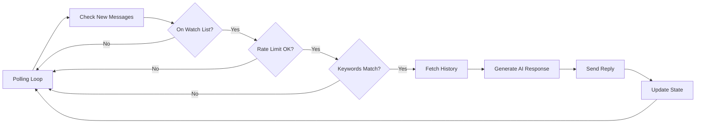

# 📱 iMessage Auto-Responder

> Automatically respond to iMessages and SMS from specific contacts using AI-generated replies that match your voice and conversation context.

[](https://opensource.org/licenses/MIT)
[](https://www.apple.com/macos/)
[](https://nodejs.org/)

---

## ✨ Features

| Feature | Description |
|---------|-------------|
| 🤖 **AI-Powered** | OpenAI GPT-4 generates contextual, natural responses |
| 📱 **Contact-Based Prompts** | Different AI personality per contact |
| ⏱️ **Rate Limiting** | Configurable delays between auto-responses |
| 💬 **Context-Aware** | AI sees recent conversation history for better replies |
| 📊 **Telegram Management** | Full control via slash commands or natural language |
| 🔄 **Background Monitoring** | Runs continuously via polling (5-second intervals) |
| 📝 **Activity Logging** | Track what was sent and when |
| 🔧 **Auto-Cleanup** | Clears stale processing locks on restart |
| 🧪 **Test Mode** | Preview AI responses without sending |
| ⏰ **Time Windows** | Only respond during specific hours (e.g., 9 AM - 10 PM) |
| 🔑 **Keyword Triggers** | Only respond if message contains specific keywords |
| 📊 **Statistics Tracking** | Track total responses, daily counts, averages |
| 🚦 **Daily Reply Cap** | Limit max replies per day per contact (safety feature) |

---

## 📋 Requirements

### System Requirements

- ✅ **macOS** with Messages.app signed in to iMessage
- ✅ **Node.js** v14+ (included with Clawdbot)
- ✅ **Full Disk Access** for Terminal/iTerm
- ✅ **Messages automation permission** (macOS prompts on first use)

### Dependencies

#### 1. imsg CLI
iMessage command-line tool by Peter Steinberger:

```bash
brew install steipete/tap/imsg
```

#### 2. OpenAI API Key
Add to your Clawdbot config (`~/.clawdbot/clawdbot.json`):

```json
{
  "skills": {
    "openai-whisper-api": {
      "apiKey": "sk-proj-YOUR_KEY_HERE"
    }
  }
}
```

🔗 Get your API key: https://platform.openai.com/api-keys

#### 3. macOS Permissions

Grant the following permissions:

1. **Full Disk Access** for Terminal/iTerm:
   - System Settings → Privacy & Security → Full Disk Access
   - Add Terminal.app or iTerm.app
   - Restart Terminal after granting

2. **Messages Automation** (macOS will prompt automatically on first send)

---

## 🚀 Quick Start

### Installation

#### Via ClawdHub (Recommended)

```bash
clawdhub install imsg-autoresponder
```

#### Manual Installation

1. Download `imsg-autoresponder.skill`
2. Install:
   ```bash
   clawdbot skill install imsg-autoresponder.skill
   ```

### Setup

#### 1️⃣ Add Your First Contact

**Via Telegram:**
```
/autorespond_add +15551234567 "Best Friend" "Reply with sarcastic humor"
```

**Or naturally:**
```
Add +15551234567 to the auto-responder with name "Best Friend" and prompt "Reply with sarcastic humor"
```

#### 2️⃣ Start the Watcher

```bash
cd ~/clawd/imsg-autoresponder/scripts
./launcher.sh start
```

**Or via Telegram:**
```
/autorespond_restart
```

#### 3️⃣ Test It!

Have the contact text you. The auto-responder will reply within 5 seconds (default polling interval).

---

## 💬 Usage

### Telegram Commands

All commands support **both space and underscore formats**:

#### Core Commands

| Command | Description |
|---------|-------------|
| `/autorespond list` or `/autorespond_list` | Show all contacts on watch list |
| `/autorespond status` or `/autorespond_status` | Show watcher process status |
| `/autorespond add` or `/autorespond_add <number> <name> <prompt>` | Add new contact |
| `/autorespond edit` or `/autorespond_edit <number> <prompt>` | Edit contact's prompt |
| `/autorespond remove` or `/autorespond_remove <number>` | Remove contact |
| `/autorespond delay` or `/autorespond_delay <number> <minutes>` | Set reply delay |
| `/autorespond history` or `/autorespond_history <number>` | Show response history |
| `/autorespond test` or `/autorespond_test <number> <message>` | Test without sending |
| `/autorespond toggle` or `/autorespond_toggle` | Enable/disable system |
| `/autorespond restart` or `/autorespond_restart` | Restart watcher process |

#### Bulk Operations

| Command | Description |
|---------|-------------|
| `/autorespond set-all-delays <minutes>` | Set delay for all contacts |
| `/autorespond enable-all` | Enable all contacts |
| `/autorespond disable-all` | Disable all contacts |

#### Time Windows

Control when auto-responses are active (per contact):

| Command | Description |
|---------|-------------|
| `/autorespond set-time-window <number> <start> <end>` | Add time window (e.g., 09:00 22:00) |
| `/autorespond clear-time-windows <number>` | Clear all time windows |

**Examples:**
```
/autorespond_set_time_window +15551234567 09:00 22:00
/autorespond_set_time_window +15551234567 08:00 12:00
/autorespond_clear_time_windows +15551234567
```

#### Keyword Triggers

Only respond when messages contain specific keywords (case-insensitive):

| Command | Description |
|---------|-------------|
| `/autorespond add-keyword <number> <keyword>` | Add keyword trigger |
| `/autorespond remove-keyword <number> <keyword>` | Remove keyword |
| `/autorespond clear-keywords <number>` | Clear all keywords |

**Examples:**
```
/autorespond_add_keyword +15551234567 urgent
/autorespond_add_keyword +15551234567 help
/autorespond_remove_keyword +15551234567 urgent
/autorespond_clear_keywords +15551234567
```

> **How it works:** If no keywords are set, responds to all messages (after rate limiting). If keywords exist, only responds when message contains at least one keyword.

#### Statistics & Limits

| Command | Description |
|---------|-------------|
| `/autorespond stats [<number>]` | View response statistics (all or specific contact) |
| `/autorespond set-daily-cap <number> <max>` | Set max replies per day (0 = unlimited) |

**Examples:**
```
/autorespond_stats
/autorespond_stats +15551234567
/autorespond_set_daily_cap +15551234567 10
```

### Natural Language Control

Just ask your Clawdbot agent naturally:

- _"Show me the auto-responder status"_
- _"Add my brother Scott to the watch list"_
- _"Change Mom's prompt to be more casual"_
- _"What has the auto-responder sent to Foxy?"_
- _"Disable auto-replies for Scott"_
- _"Only respond to Scott if he says 'help'"_

---

## ⚙️ Configuration

### Time Windows

Restrict auto-responses to specific hours per contact:

```bash
# Only respond between 9 AM and 10 PM
/autorespond_set_time_window +15551234567 09:00 22:00

# Add multiple windows (morning and evening)
/autorespond_set_time_window +15551234567 08:00 12:00
/autorespond_set_time_window +15551234567 17:00 23:00

# Remove all time windows (respond 24/7)
/autorespond_clear_time_windows +15551234567
```

**Use Cases:**
- ✅ Respect work hours (only respond 9-5)
- ✅ Avoid late night texts (cutoff at 10 PM)
- ✅ Weekend-only responses
- ✅ Different hours per contact

### Keyword Triggers

Only respond when messages contain specific keywords:

```bash
# Only respond if message contains "urgent" or "help"
/autorespond_add_keyword +15551234567 urgent
/autorespond_add_keyword +15551234567 help

# Add "emergency" keyword for Mom
/autorespond_add_keyword +19028778490 emergency

# Remove a keyword
/autorespond_remove_keyword +15551234567 urgent

# Clear all keywords (respond to all messages)
/autorespond_clear_keywords +15551234567
```

**Use Cases:**
- ✅ Only respond to urgent/important messages
- ✅ Filter casual vs. serious conversations
- ✅ Require explicit trigger words ("help", "question", "emergency")
- ✅ Different keywords per contact

### Statistics Tracking

View response statistics:

```bash
# All contacts
/autorespond_stats

# Specific contact
/autorespond_stats +15551234567
```

**Tracked Metrics:**
- Total responses (all-time)
- Daily count (today)
- Average responses per day
- First and last response dates

### Daily Reply Cap

Limit auto-replies per contact per day:

```bash
# Set max 10 replies per day for Scott
/autorespond_set_daily_cap +15551234567 10

# Remove limit (unlimited)
/autorespond_set_daily_cap +15551234567 0
```

**Use Cases:**
- ✅ Prevent spam if someone texts repeatedly
- ✅ Safety cap during testing
- ✅ Different limits per contact
- ✅ Protects against runaway conversations

### Prompt Engineering

Prompts define how the AI responds. Be specific!

**Good Examples:**

```
"Reply with only a middle finger emoji"

"You are Drac's AI. Match their energy - vulgar with vulgar, 
serious with serious. Keep it short and natural."

"Be polite and helpful. Keep responses under 160 characters."

"Respond as if you're my assistant. Professional but warm. 
If they ask about my availability, check my calendar."
```

### Rate Limiting

Control reply frequency:

```bash
# 30 minutes between replies
/autorespond_delay +15551234567 30

# Instant replies (testing only!)
/autorespond_delay +15551234567 0
```

---

## 🔧 Troubleshooting

### Watcher Not Responding

**Check status:**
```
/autorespond_status
```

**Restart if needed:**
```
/autorespond_restart
```

**Check logs:**
```bash
tail -f ~/clawd/logs/imsg-autoresponder.log
```

### Common Issues

#### ❌ "OPENAI_API_KEY not found"

**Solution:** Add API key to `~/.clawdbot/clawdbot.json`:
```json
{
  "skills": {
    "openai-whisper-api": {
      "apiKey": "sk-proj-YOUR_KEY_HERE"
    }
  }
}
```
Restart watcher after adding.

#### ❌ "Permission denied" / "Operation not permitted"

**Solution:** 
1. Grant Full Disk Access to Terminal
2. System Settings → Privacy & Security → Full Disk Access
3. Add Terminal.app
4. Restart Terminal

#### ❌ Messages not being detected

**Solution:**
1. Verify `imsg watch --json` works manually
2. Check Messages.app is signed in
3. Confirm contact is in watch list: `/autorespond_list`

#### ❌ Responses are too long/verbose

**Solution:** Edit prompt to emphasize brevity:
```
/autorespond_edit +15551234567 Keep replies to 1-2 sentences max. Be concise.
```

### Testing Without Sending

Preview real AI responses without sending:

```
/autorespond_test +15551234567 Hey what's up?
```

Perfect for testing new prompts before going live! ✅

---

## 🏗️ Architecture

### Components

- **`watcher.js`** - Background polling process that monitors iMessages
- **`manage.js`** - CLI for configuration management
- **`telegram-handler.js`** - Telegram command interface
- **`launcher.sh`** - Start/stop/status helper script

### How It Works



1. **Polling loop** checks `imsg chats` every 5 seconds
2. **New messages** detected by comparing timestamps
3. **Rate limiting** prevents spam (configurable delay per contact)
4. **Processing lock** prevents duplicate responses during AI generation
5. **OpenAI API** generates contextual responses using conversation history
6. **Response sent** via `imsg send`
7. **State saved** (last response time, last checked time)

### Data Storage

| File | Purpose |
|------|---------|
| `~/clawd/imsg-autoresponder.json` | Configuration (watch list, prompts) |
| `~/clawd/data/imsg-autoresponder-state.json` | State tracking (last response times) |
| `~/clawd/logs/imsg-autoresponder.log` | Activity logs |
| `~/clawd/data/imsg-autoresponder.pid` | Process ID file |

---

## 🛡️ Safety Features

- ✅ **Rate limiting** prevents spam (configurable per contact)
- ✅ **Processing locks** prevent duplicate sends
- ✅ **Manual override** - disable any contact instantly
- ✅ **System toggle** - pause all auto-responses
- ✅ **Full logging** - review everything that was sent
- ✅ **Test mode** - preview responses before enabling
- ✅ **Daily caps** - limit max replies per day
- ✅ **Time windows** - only respond during specific hours
- ✅ **Keyword triggers** - require specific words to respond

---

## 🗺️ Roadmap

- [x] Time windows (only respond during certain hours) - **v1.1**
- [x] Keyword triggers (only respond if message contains specific words) - **v1.1**
- [x] Statistics tracking (response counts, daily totals) - **v1.1**
- [x] Max replies per day cap - **v1.1**
- [ ] Smart rate limiting based on conversation patterns
- [ ] Group chat support
- [ ] Web dashboard
- [ ] Voice message transcription support
- [ ] Multi-language support
- [ ] Sentiment analysis for better tone matching

---

## ⚠️ Privacy & Ethics

> **Important:** This tool sends messages on your behalf automatically. Use responsibly.

### Guidelines

- ✅ Only add contacts who know they're texting an AI or won't mind
- ✅ Be transparent about AI usage when appropriate
- ✅ Review responses regularly via `/autorespond_history`
- ❌ Don't use for deceptive purposes
- ❌ Don't impersonate someone without their knowledge
- ✅ Respect the boundaries of others
- ✅ Disable auto-responses for sensitive conversations

---

## 🤝 Contributing

Found a bug? Have a feature idea?

- **GitHub:** https://github.com/clawdbot/clawdbot
- **Discord:** https://discord.com/invite/clawd
- **ClawdHub:** https://clawdhub.com

---

## 📄 License

MIT License - see Clawdbot repository for full license text.

---

## 🙏 Credits

Built with ❤️ by the Clawdbot community.

**Powered by:**
- [imsg](https://imsg.to) by Peter Steinberger
- [OpenAI GPT-4](https://openai.com)
- [Clawdbot Agent Framework](https://clawd.bot)

---

<p align="center">
  <strong>Made with 🤖 + ☕ by the Clawdbot community</strong>
</p>
