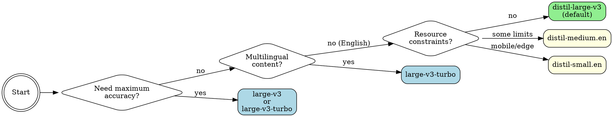

# Faster Whisper

Local speech-to-text using faster-whisper — a CTranslate2 reimplementation of OpenAI's Whisper that runs **4-6x faster** with identical accuracy. With GPU acceleration, expect **~20x realtime** transcription (a 10-minute audio file in ~30 seconds).

## When to Use

Use this skill when you need to:
- **Transcribe audio/video files** — meetings, interviews, podcasts, lectures, YouTube videos
- **Convert speech to text locally** — no API costs, works offline (after model download)
- **Batch process multiple audio files** — efficient for large collections
- **Generate subtitles/captions** — word-level timestamps available
- **Multilingual transcription** — supports 99+ languages with auto-detection

**Trigger phrases:** "transcribe this audio", "convert speech to text", "what did they say", "make a transcript", "audio to text", "subtitle this video"

**When NOT to use:**
- Real-time/streaming transcription (use streaming-optimized tools instead)
- Cloud-only environments without local compute
- Files <10 seconds where API call latency doesn't matter

## Quick Reference

| Task | Command | Notes |
|------|---------|-------|
| **Basic transcription** | `./scripts/transcribe audio.mp3` | Uses default distil-large-v3 |
| **Faster English** | `./scripts/transcribe audio.mp3 --model distil-medium.en --language en` | English-only, 6.8x faster |
| **Maximum accuracy** | `./scripts/transcribe audio.mp3 --model large-v3-turbo --beam-size 10` | Slower but best quality |
| **Word timestamps** | `./scripts/transcribe audio.mp3 --word-timestamps` | For subtitles/captions |
| **JSON output** | `./scripts/transcribe audio.mp3 --json -o output.json` | Programmatic access |
| **Multilingual** | `./scripts/transcribe audio.mp3 --model large-v3-turbo` | Auto-detects language |
| **Remove silence** | `./scripts/transcribe audio.mp3 --vad` | Voice activity detection |

## Model Selection

Choose the right model for your needs:



### Model Table

#### Standard Models (Full Whisper)
| Model | Size | Speed | Accuracy | Use Case |
|-------|------|-------|----------|----------|
| `tiny` / `tiny.en` | 39M | Fastest | Basic | Quick drafts |
| `base` / `base.en` | 74M | Very fast | Good | General use |
| `small` / `small.en` | 244M | Fast | Better | Most tasks |
| `medium` / `medium.en` | 769M | Moderate | High | Quality transcription |
| `large-v1/v2/v3` | 1.5GB | Slower | Best | Maximum accuracy |
| **`large-v3-turbo`** | 809M | Fast | Excellent | **Recommended for accuracy** |

#### Distilled Models (~6x Faster, ~1% WER difference)
| Model | Size | Speed vs Standard | Accuracy | Use Case |
|-------|------|-------------------|----------|----------|
| **`distil-large-v3`** | 756M | ~6.3x faster | 9.7% WER | **Default, best balance** |
| `distil-large-v2` | 756M | ~5.8x faster | 10.1% WER | Fallback |
| `distil-medium.en` | 394M | ~6.8x faster | 11.1% WER | English-only, resource-constrained |
| `distil-small.en` | 166M | ~5.6x faster | 12.1% WER | Mobile/edge devices |

`.en` models are English-only and slightly faster/better for English content.

## Setup

### Linux / macOS / WSL2
```bash
# Run the setup script (creates venv, installs deps, auto-detects GPU)
./setup.sh
```

### Windows (Native)
```powershell
# Run from PowerShell (auto-installs Python & ffmpeg if missing via winget)
.\setup.ps1
```

The Windows setup script will:
- Auto-install Python 3.12 via winget if not found
- Auto-install ffmpeg via winget if not found
- Detect NVIDIA GPU and install CUDA-enabled PyTorch
- Create venv and install all dependencies

Requirements:
- **Linux/macOS/WSL2**: Python 3.10+, ffmpeg
- **Windows**: Nothing! Setup auto-installs prerequisites via winget

### Platform Support

| Platform | Acceleration | Speed | Auto-Install |
|----------|-------------|-------|--------------|
| **Windows + NVIDIA GPU** | CUDA | ~20x realtime 🚀 | ✅ Full |
| **Linux + NVIDIA GPU** | CUDA | ~20x realtime 🚀 | Manual prereqs |
| **WSL2 + NVIDIA GPU** | CUDA | ~20x realtime 🚀 | Manual prereqs |
| macOS Apple Silicon | CPU* | ~3-5x realtime | Manual prereqs |
| macOS Intel | CPU | ~1-2x realtime | Manual prereqs |
| Windows (no GPU) | CPU | ~1x realtime | ✅ Full |
| Linux (no GPU) | CPU | ~1x realtime | Manual prereqs |

*faster-whisper uses CTranslate2 which is CPU-only on macOS, but Apple Silicon is fast enough for practical use.

### GPU Support (IMPORTANT!)

The setup script auto-detects your GPU and installs PyTorch with CUDA. **Always use GPU if available** — CPU transcription is extremely slow.

| Hardware | Speed | 9-min video |
|----------|-------|-------------|
| RTX 3070 (GPU) | ~20x realtime | ~27 sec |
| CPU (int8) | ~0.3x realtime | ~30 min |

If setup didn't detect your GPU, manually install PyTorch with CUDA:

**Linux/macOS/WSL2:**
```bash
# For CUDA 12.x
uv pip install --python .venv/bin/python torch --index-url https://download.pytorch.org/whl/cu121

# For CUDA 11.x
uv pip install --python .venv/bin/python torch --index-url https://download.pytorch.org/whl/cu118
```

**Windows:**
```powershell
# For CUDA 12.x
.venv\Scripts\pip install torch --index-url https://download.pytorch.org/whl/cu121

# For CUDA 11.x
.venv\Scripts\pip install torch --index-url https://download.pytorch.org/whl/cu118
```

- **Windows users**: Ensure you have [NVIDIA drivers](https://www.nvidia.com/download/index.aspx) installed
- **WSL2 users**: Ensure you have the [NVIDIA CUDA drivers for WSL](https://docs.nvidia.com/cuda/wsl-user-guide/) installed on Windows

## Usage

**Linux/macOS/WSL2:**
```bash
# Basic transcription
./scripts/transcribe audio.mp3

# With specific model
./scripts/transcribe audio.wav --model large-v3-turbo

# With word timestamps
./scripts/transcribe audio.mp3 --word-timestamps

# Specify language (faster than auto-detect)
./scripts/transcribe audio.mp3 --language en

# JSON output
./scripts/transcribe audio.mp3 --json
```

**Windows (cmd or PowerShell):**
```powershell
# Basic transcription
.\scripts\transcribe.cmd audio.mp3

# With specific model
.\scripts\transcribe.cmd audio.wav --model large-v3-turbo

# With word timestamps (PowerShell native syntax also works)
.\scripts\transcribe.ps1 audio.mp3 -WordTimestamps

# JSON output
.\scripts\transcribe.cmd audio.mp3 --json
```

## Options

```
--model, -m        Model name (default: distil-large-v3)
--language, -l     Language code (e.g., en, es, fr - auto-detect if omitted)
--word-timestamps  Include word-level timestamps
--beam-size        Beam search size (default: 5, higher = more accurate but slower)
--vad              Enable voice activity detection (removes silence)
--json, -j         Output as JSON
--output, -o       Save transcript to file
--device           cpu or cuda (auto-detected)
--compute-type     int8, float16, float32 (default: auto-optimized)
--quiet, -q        Suppress progress messages
```

## Examples

```bash
# Transcribe YouTube audio (after extraction with yt-dlp)
yt-dlp -x --audio-format mp3 <URL> -o audio.mp3
./scripts/transcribe audio.mp3

# Batch transcription with JSON output
for file in *.mp3; do
  ./scripts/transcribe "$file" --json > "${file%.mp3}.json"
done

# High-accuracy transcription with larger beam size
./scripts/transcribe audio.mp3 \
  --model large-v3-turbo --beam-size 10 --word-timestamps

# Fast English-only transcription
./scripts/transcribe audio.mp3 \
  --model distil-medium.en --language en

# Transcribe with VAD (removes silence)
./scripts/transcribe audio.mp3 --vad
```

## Common Mistakes

| Mistake | Problem | Solution |
|---------|---------|----------|
| **Using CPU when GPU available** | 10-20x slower transcription | Check `nvidia-smi` on Windows/Linux; verify CUDA installation |
| **Not specifying language** | Wastes time auto-detecting on known content | Use `--language en` when you know the language |
| **Using wrong model** | Unnecessary slowness or poor accuracy | Default `distil-large-v3` is excellent; only use `large-v3` if accuracy issues |
| **Ignoring distilled models** | Missing 6x speedup with <1% accuracy loss | Try `distil-large-v3` before reaching for standard models |
| **Forgetting ffmpeg** | Setup fails or audio can't be processed | Setup script handles this; manual installs need ffmpeg separately |
| **Out of memory errors** | Model too large for available VRAM/RAM | Use smaller model or `--compute-type int8` |
| **Over-engineering beam size** | Diminishing returns past beam-size 5-7 | Default 5 is fine; try 10 for critical transcripts |

## Performance Notes

- **First run**: Downloads model to `~/.cache/huggingface/` (one-time)
- **GPU**: Automatically uses CUDA if available (~10-20x faster)
- **Quantization**: INT8 used on CPU for ~4x speedup with minimal accuracy loss
- **Memory**:
  - `distil-large-v3`: ~2GB RAM / ~1GB VRAM
  - `large-v3-turbo`: ~4GB RAM / ~2GB VRAM
  - `tiny/base`: <1GB RAM

## Why faster-whisper?

- **Speed**: ~4-6x faster than OpenAI's original Whisper
- **Accuracy**: Identical (uses same model weights)
- **Efficiency**: Lower memory usage via quantization
- **Production-ready**: Stable C++ backend (CTranslate2)
- **Distilled models**: ~6x faster with <1% accuracy loss

## Troubleshooting

**"CUDA not available — using CPU"**: Install PyTorch with CUDA (see GPU Support above)
**Setup fails**: Make sure Python 3.10+ is installed
**Out of memory**: Use smaller model or `--compute-type int8`
**Slow on CPU**: Expected — use GPU for practical transcription
**Model download fails**: Check `~/.cache/huggingface/` permissions (Linux/macOS) or `%USERPROFILE%\.cache\huggingface\` (Windows)

### Windows-Specific

**"winget not found"**: Install [App Installer](https://apps.microsoft.com/detail/9NBLGGH4NNS1) from Microsoft Store, or install Python/ffmpeg manually
**"Python not in PATH after install"**: Close and reopen your terminal, then run `setup.ps1` again
**PowerShell execution policy error**: Run `Set-ExecutionPolicy -Scope CurrentUser -ExecutionPolicy RemoteSigned` or use `transcribe.cmd` instead
**nvidia-smi not found but have GPU**: Install [NVIDIA drivers](https://www.nvidia.com/download/index.aspx) — the Game Ready or Studio drivers include nvidia-smi

## References

- [faster-whisper GitHub](https://github.com/SYSTRAN/faster-whisper)
- [Distil-Whisper Paper](https://arxiv.org/abs/2311.00430)
- [HuggingFace Models](https://huggingface.co/collections/Systran/faster-whisper)
